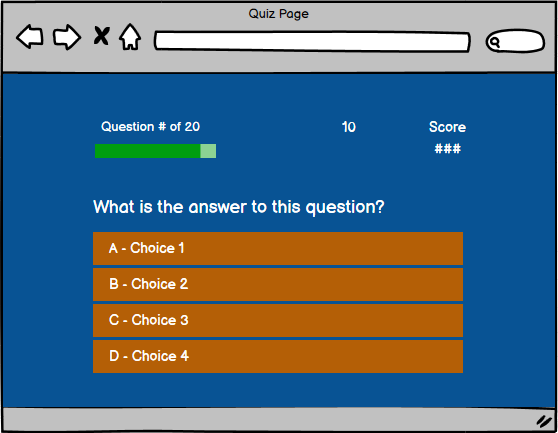
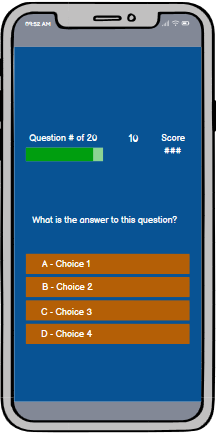

# Terry's General Knowledge Quiz Game

- Welcome to Terry's General Knowledge Quiz Game! This interactive quiz challenges players with 20 questions covering a wide range of topics. As you progress through the game, your score will be updated in real-time, allowing you to see how well you're doing after each question.

# UX

- The General Knowledge Quiz Game is designed to provide a seamless, engaging, and intuitive experience for players of all ages. The game flow, feedback mechanisms, and user interface have been carefully crafted to ensure that players can focus on the challenge of answering questions while enjoying a smooth and rewarding experience.

- Overall, the General Knowledge Quiz Game is designed to be engaging, easy to navigate, and rewarding, with a focus on clear feedback and a competitive edge through the leaderboard system.

## 1. Starting the Game

 - Welcome Screen: Players are greeted with a clean and inviting welcome screen featuring clear options to start the game or view the leaderboard.

 - Easy Navigation: The user interface is straightforward, with prominent buttons for starting the quiz, making it easy for users to begin.

## 2. Gampeplay Experieance

- Question Display: Each of the 20 questions is presented one at a time, with a simple and legible layout. The current question number and score are displayed at the top, keeping players informed of their progress.

- Real-Time Feedback: As players select answers, their score is immediately updated and displayed on the screen, providing instant gratification or motivation to improve.

- Clear Instructions: Instructions are minimal and intuitive, allowing players to focus on answering questions without unnecessary distractions.

## 3. End of Game and Scoring

- Final Score Display: At the end of the quiz, players see their final score prominently displayed, offering a moment of reflection on their performance.

- Name Entry Requirement: To save their score, players are prompted to enter their name. This step is mandatory, ensuring that the leaderboard remains personalized and competitive.

- Error Handling: If a player attempts to save their score without entering a name, a friendly reminder prompts them to do so.

## 4. Leaderboard and Replay Options

- Leaderboard Integration: After entering their name, players see their score added to the leaderboard. This page is designed to motivate players by showcasing top scores and encouraging them to aim higher.

- Play Again: From the leaderboard, players can easily choose to replay the quiz, offering an opportunity to improve their score and climb the rankings.

## 5. Responsive Design

- Mobile-Friendly: The game is optimized for various devices, ensuring that the experience is consistent and enjoyable whether played on a desktop, tablet, or smartphone.

# User Stories

- As a **user** I want **to easily start the quiz from the home screen** so that **I can quickly begin answering questions**.

- As a **user** I want **to see the current question number and my score as I progress through the quiz** so that **I can keep track of my performance**.

- As a **user**, I want **the quiz questions to be displayed clearly with multiple-choice options** so that **I can easily select my answers**.

- As a **user**, I want **to receive immediate feedback on my score after each question** so that **I can know how well I’m doing in real-time**.

- As a **user**, I want **to view my final score after completing the quiz** so that **I can reflect on my overall performance**.

- As a **user**, I want **to be required to enter my name before saving my score** so that **the leaderboard displays personalized entries**.

- As a **user**, I want **to see an error message if I try to save my score without entering my name** so that **I’m reminded to enter my name**.

- As a **user**, I want **to see the leaderboard with top scores after saving my score** so that **I can compare my performance with others**.

- As a **user**, I want **the option to replay the quiz from the leaderboard screen** so that **I can attempt to improve my score**.

- As a **user**, I want **the quiz game to be accessible and responsive on various devices (e.g., desktop, tablet, mobile)** so that **I can enjoy the game on any device**.

# Features

- 20 Challenging Questions: Test your knowledge with a variety of questions from different subjects.

- Real-Time Scoring: Your score is displayed as you answer each question, giving you instant feedback.

- Leaderboard Integration: At the end of the game, you'll be prompted to enter your name before saving your score to the leaderboard.

- Save and Compete: Your name and score are saved to a leaderboard, where you can see how you stack up against your individual previous attempts.

- Play Again: After completing the quiz, you can choose to play again and improve your score.

### Site Wireframes

-__Home Page__

-__Quiz Game Page__

-__Submit Score or End Page__

-__Leaderboard or Top Scores Page__

## Surface

Favicon logo designed on: (https://favicon.io/logo-generator/)

### Design

The home icon and crown icons where used from the Fontawesome libraries gathered from (https://fontawesome.com/)

#### Selected Colors

__Background color__ - Dark Cerulean

__Progress Bar color__ - Green

__Choice containter__ - Orange

__Correct Answer__ - Green

__Incorrect Answer__ - Red

### fonts

The "Ubuntu" cursive font was utilised. Generated from Google Fonts (https://fonts.google.com/?preview.layout=grid)

## Technologies Utilised

- HTML

- CSS3

- JavaScript

## Testing

The quiz game has been tested on Safari, Opera, Chrome and Microsoft Edge

The quiz game has been vigorously tested throughout the developmment process for responsiveness across various devices curtesy of the chrome developer tools

### Validating

- HTML

  - [HTML Validation](https://validator.w3.org/)

  

- CSS

  -[CSS Validation](https://jigsaw.w3.org/css-validator/)

  

- JavaScript

  - [JavaScript Validation](https://validator.w3.org/)

  

- Lighthouse tools were also utilised to test the website.

Desktop :

Mobile View:

## User Story Testing

__1__ - As a **user** I want **to easily start the quiz from the home screen** so that **I can quickly begin answering questions**.

__2__ - As a **user** I want **to see the current question number and my score as I progress through the quiz** so that **I can keep track of my performance**.

__3__ - As a **user**, I want **the quiz questions to be displayed clearly with multiple-choice options** so that **I can easily select my answers**.

__4__ - As a **user**, I want **to receive immediate feedback on my score after each question** so that **I can know how well I’m doing in real-time**.

__5__ - As a **user**, I want **to view my final score after completing the quiz** so that **I can reflect on my overall performance**.

__6__ - As a **user**, I want **to be required to enter my name before saving my score** so that **the leaderboard displays personalized entries**.

__7__ - As a **user**, I want **to see an error message if I try to save my score without entering my name** so that **I’m reminded to enter my name**.

__8__- As a **user**, I want **to see the leaderboard with top scores after saving my score** so that **I can compare my performance with others**.

__9__- As a **user**, I want **the option to replay the quiz from the leaderboard screen** so that **I can attempt to improve my score**.

__10__ - As a **user**, I want **the quiz game to be accessible and responsive on various devices (e.g., desktop, tablet, mobile)** so that **I can enjoy the game on any device**.

### Features For Future Implementation

The below features can significantly enhance the user experience and engagement with the quiz game, offering more variety, challenge, and interactivity.

__1__ - __Timer-Based Questions__

- Description: Introduce a countdown timer for each question, adding an element of urgency and challenge. Players must answer within the given time frame or the question will be marked incorrect.

__2__ - __Question Categories__

- Description: Allow users to select specific categories of questions (e.g., History, Science, Entertainment) before starting the quiz, providing a more tailored experience.

__3__ - __Difficulty Levels__

- Description: Implement varying difficulty levels (Easy, Medium, Hard) that users can choose from. This could involve more challenging questions or stricter time limits for harder levels.

__4__ - __Hint System__

- Description: Add a hint system that allows users to spend points or take a penalty to receive hints or eliminate incorrect answers for particularly tough questions.

__5__ - __Multiplayer Mode__

- Description: Develop a multiplayer mode where users can compete against friends or other players online in real-time, seeing who can answer the most questions correctly within a time limit.

__6__ - __Social Sharing of Scores__

- Description: Integrate social media sharing options, allowing users to post their final scores to platforms like Twitter or Facebook, challenging friends to beat their high scores.

__7__ - __Progressive Difficulty__

- Description: Implement a system where the difficulty of questions increases as the player progresses through the quiz, maintaining a challenging experience throughout.

__8__ - __Achievements and Badges__

- Description: Introduce a system of achievements and badges that players can earn for reaching certain milestones, such as answering all questions correctly, achieving a streak of correct answers, or completing a certain number of quizzes.

__9__ - __Audio and Visual Feedback__

- Description: Enhance the game experience with sound effects and animations that respond to correct or incorrect answers, as well as dynamic transitions between questions.

__10__ - __In-Depth Analytics__

- Description: Provide users with detailed analytics at the end of the quiz, such as their accuracy percentage, time taken per question, and performance trends over multiple games.

## Known Issues and Bugs

__1__ - __Inconsistent Score Display__

- Description: Occasionally, the score may not update correctly during the quiz, showing the previous score instead of the updated one.

- Workaround: Refresh the page to reset the game. If the issue persists, clear your browser’s cache and try again.

__2__ - __Name Field Validation__

- Description: The game may allow users to attempt to save their score without entering a valid name, especially if the name field is autofilled by the browser.

- Workaround: Ensure that users manually input their names before attempting to save their scores.

__3__ - __Leaderboard Duplication__

- Description: In rare cases, the same score may appear multiple times on the leaderboard if the save button is clicked multiple times rapidly.

- Workaround: Avoid clicking the save button multiple times. If duplication occurs, refresh the page to view the correct leaderboard.

__4__ - __Responsive Design Issues on Small Screens__

- Description: On some small mobile devices, the game elements may not be perfectly aligned or may require excessive scrolling.

- Workaround: Adjust the zoom level of the browser or try switching to landscape mode for better visibility.

__5__ - __Slow Performance on Older Browsers__

- Description: The game may experience slow performance or lag when played on older web browsers, particularly those that do not fully support modern JavaScript or CSS features.

- Workaround: Use the latest version of Chrome, Firefox, Safari, or Edge for the best experience.

__6__ - __Form Submission Delays__

- Description: After entering their name and clicking the save button, users may experience a delay before the leaderboard updates.

- Workaround: Please wait a few seconds after submitting. If the delay persists, check your internet connection.

__7__ - __Navigation Issues on Some Mobile Devices__

- Description: Users on certain mobile devices may find it difficult to navigate back to the home page or restart the game after finishing the quiz.

- Workaround: Use the browser’s back button or manually refresh the page to restart the game.

__8__ - __Missing or Incorrect Icons__

- Description: In some cases, the Font Awesome icons used on buttons (such as the home or crown icons) may not display correctly.

- Workaround: Ensure a stable internet connection as the icons are fetched from an external CDN. Try clearing the browser cache if the problem persists.

__9__ - __Progress Bar Display Issues__

- Description: The progress bar that shows how many questions have been answered may not fill up correctly if the browser window is resized during the game.

- Workaround: Avoid resizing the browser window during gameplay. If this issue occurs, refresh the page to reset the game.

__10__ - __Local Storage Limits__

- Description: The leaderboard data is stored in the browser's local storage, which has size limitations. Over time, this may cause issues with saving new scores.

- Workaround: Clear your browser’s local storage periodically, but be aware that this will also delete your saved leaderboard data.

## Deployment

### Credits

Credit to stack overflow on understaning certain concepts used in this project.

### Content

## Acknowledgements

Chat GPT with suggesting questions included in the game.

### Terry's General Knowledge Quiz Game Designed by

Terence Zengeya
